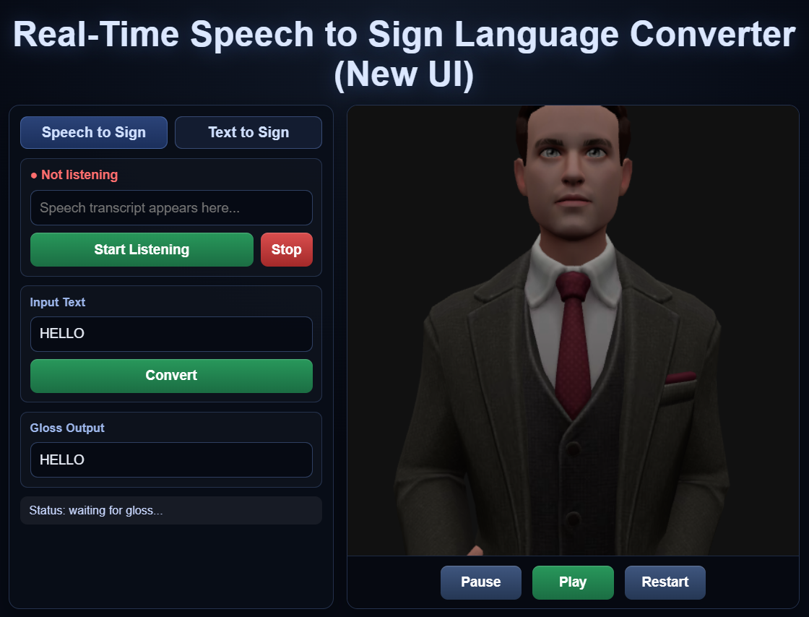

# 🎭 Real-Time Speech to Sign Language Translation using 3D Avatar

A Project that converts spoken English into American Sign Language (ASL) gloss and renders it using a real-time 3D avatar driven by motion keypoints extracted from the WLASL dataset.

---

## New UI


## ✅ Quick Start (Current Setup)

key Requirement:
Use Python 3.11 virtualenv (`venv311`) for stable MediaPipe Holistic extraction.

### 1) Create and install

```powershell
py -3.11 -m venv venv311
.\venv311\Scripts\python -m pip install --upgrade pip
.\venv311\Scripts\python -m pip install -r requirements.txt
```

### 2) Prepare datasets

- ASLG_PC12 CSV is supported at either:
  - `backend/datasets/aslg_pc12/train.csv`
  
- WLASL (Kaggle): [wlasl-processed](https://www.kaggle.com/datasets/risangbaskoro/wlasl-processed)

Build map + extract keypoints (example):

```powershell
.\venv311\Scripts\python -m backend.datasets.wlasl.prepare_wlasl --all --max-words 300 --extract-python .\venv311\Scripts\python
```

### 3) (Optional) Train text->gloss model

```powershell
.\venv311\Scripts\python -m backend.gloss.train --epochs 5 --batch-size 16
```

### 4) Run app

Terminal 1 (backend + keypoints + API):

```powershell
.\venv311\Scripts\python -m backend.avatar.serve_keypoints
```

Terminal 2 (speech pipeline):

```powershell
.\venv311\Scripts\python -m backend.speech.live_whisper
```

Open browser:

- `http://127.0.0.1:9000/frontend/avatar_viewer/`

## 🚀 Project Overview

This system performs:

🎤 Speech → Text (Whisper)  
🧠 Text → ASL Gloss (Rule-based + fallback mapping)  
📦 Gloss → Motion Clip Lookup  
🦴 Motion Keypoints → 3D Avatar Rendering (Three.js)  

The avatar animation is generated from MediaPipe keypoints extracted from the WLASL dataset and rendered in real time using Three.js.

---

## 🧠 System Architecture

Speech (Microphone)
        ↓
Whisper (ASR)
        ↓
Gloss Inference Engine
        ↓
push_to_avatar (writes runtime/state.json)
        ↓
Frontend polls state.json
        ↓
Loads corresponding keypoints JSON
        ↓
Three.js renders animated skeleton avatar

---

## 📊 Required Datasets

### 1️⃣ ASLG_PC12 Dataset (Text → Gloss)

Used for:
- Text-to-Gloss dataset mapping
- Seq2Seq training (optional)
- Rule-based mapping

Download:
ASLG_PC12 train.csv

Place in either:
- backend/datasets/aslg_pc12/train.csv


### 2️⃣ WLASL Dataset

Used for:
- Extracting pose + hand keypoints
- Driving avatar animation

Download:
https://www.kaggle.com/datasets/risangbaskoro/wlasl-processed

Place inside:
backend/datasets/wlasl/

### 3️⃣ Custom Daily Dataset (Manually Created)

File : backend/gloss/daily_pairs.txt
Format per line : english sentence ||| GLOSS SENTENCE
Example :
hello ||| HELLO
how are you ||| HOW YOU

This dataset is merged with ASLG_PC12 during training.

---

## 🧠 Text → Gloss Strategy

The system uses a hybrid approach:

### Primary (Used in Demo)
- Dictionary-first mapping:
- Exact sentence match from daily_pairs.txt
- Word-by-word fallback
- Uppercase fallback for unknown words
- This ensures stable demo behavior.

### Optional (Experimental)
- Seq2Seq LSTM model:
- Implemented in model.py
- Trained using:
  - ASLG_PC12
  - daily_pairs.txt
- Saved as:
  - gloss_model.pt
  - tokenizer_vocab.pt

The Seq2Seq model is NOT used in the demo runtime pipeline.
It is provided for experimentation and research purposes.

---

## 🤟 Gloss → Avatar

Gloss tokens are sent to:
backend/avatar/push_to_avatar.py

This:
- Writes tokens to runtime/state.json
- Frontend polls this file
- Loads corresponding keypoint JSON
- Plays animation sequentially

Avatar uses:
- MediaPipe keypoints extracted from WLASL videos
- Three.js rendering
-Real-time playback at controlled FPS

### 🦴 Keypoint Extraction (One-Time Setup)

Extract MediaPipe keypoints from selected WLASL videos : python backend/datasets/wlasl/extract_keypoints.py

This will generate : backend/datasets/wlasl/keypoints/WORD.json

These JSON files are used for avatar animation.

---

## ⚙ Installation

### 1️⃣ Create Virtual Environment (recommended: Python 3.11)
py -3.11 -m venv venv311
venv311\Scripts\activate

### 2️⃣ Install Dependencies
pip install -r requirements.txt

Main libraries:
- openai-whisper
- sounddevice
- numpy
- mediapipe
- opencv-python

---

## ▶ Running the Project

You need **2 terminals**.

---

### 🟢 Terminal 1 — Start Keypoint Server
python -m backend.avatar.serve_keypoints

This serves:
http://127.0.0.1:9000/

---

### 🟣 Terminal 2 — Start Speech Recognition
python -m backend.speech.live_whisper

Speak into microphone.

Open in browser: http://127.0.0.1:9000/frontend/avatar_viewer/

---

## 🎬 Demo Flow

1. Speak: “Hello” (or any other words or short sentences)
2. Whisper transcribes speech.
3. Gloss engine converts to: `HELLO`
4. push_to_avatar writes: runtime/state.json
5. Browser detects change.
6. Loads: /keypoints/HELLO.json
7. Avatar performs sign animation.

---

## 🧩 Key Technologies

- OpenAI Whisper (Speech Recognition)
- PyTorch (Seq2Seq model - optional)
- MediaPipe Holistic (Keypoint extraction)
- Three.js (3D avatar rendering)
- WLASL dataset (ASL motion source)
- ASLG_PC12 dataset (Text-to-Gloss)

---

## 📌 Notes

- This system uses pre-extracted motion keypoints.
- Limited to glosses extracted from WLASL
- It does NOT generate motion using deep learning.
- Each gloss token maps to a preprocessed WLASL motion clip.
- The frontend uses file-based communication (state.json) instead of WebSockets for simplicity.

---

## 🏫 Academic Purpose

This project demonstrates:

- Real-time ASR integration
- NLP-based gloss conversion
- Dataset-driven avatar animation
- Browser-based 3D rendering
- End-to-end multimodal AI pipeline

---


